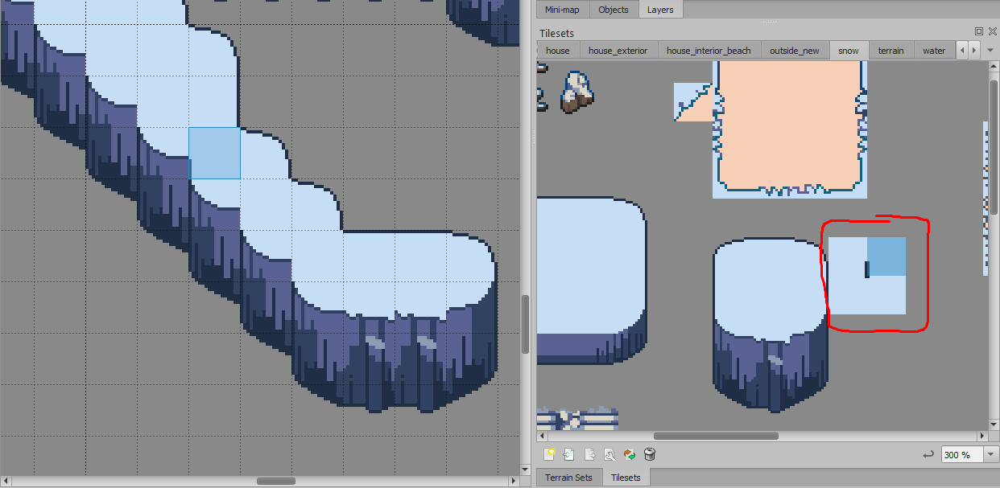

# Install

On Windows, put `cliffs.js` and `reset-cliffs.js` here:

`C:\Users\YOUR_WINDOWS_USERNAME\AppData\Local\Tiled\extensions\cliff-generator`

On Mac, put `cliffs.js` and `reset-cliffs.js` here:

`~/Library/Preferences/Tiled/extensions/`

On Linux, put `cliffs.js` and `reset-cliffs.js` here:

`~/.config/tiled/extensions/`

Alternatively, you can install your extensions in a project-specific location.  See https://doc.mapeditor.org/en/stable/reference/scripting/

# Usage

1. Paint some ground tiles on your map.

2. In your tileset, select your cliff tiles.  They should be 3 tiles wide and at least 3 tiles (but up to 5 tiles) high.

3. Click "Generate cliffs" on the toolbar.

4. Click anywhere in your map once.

## Resetting cliffs

Say you've already generated your cliffs, but you want to adjust them and re-generate them.  The "Reset cliffs" feature will reset your cliffs back to ground tiles, so that you can re-paint them and re-generate the cliffs.

To reset your cliffs, the process is similar to steps 2-4 above.  But specifically:

1. In your tileset, select your cliff tiles (the same selection you made in step 2 of the cliff generation).

2. Click "Reset cliffs" on the toolbar.

3. Click anywhere in your map once.

# Roadmap

One improvement that could be made here is to add support for these four transition tiles that are circled in the screenshot below.  I'm not sure what they're called, but they're very typical in tilesets like these.  The screenshot shows where the selected tile would be placed.

For now, those tiles still need to be placed automatically (in tilesets where they're necessary - which is probably most of them).
