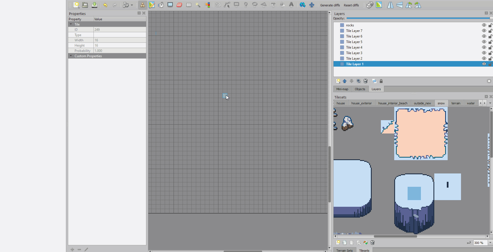

# Install

On Windows, put `cliffs.js` and `reset-cliffs.js` here:

`C:\Users\YOUR_WINDOWS_USERNAME\AppData\Local\Tiled\extensions\cliff-generator`

On Mac, put `cliffs.js` and `reset-cliffs.js` here:

`~/Library/Preferences/Tiled/extensions/`

On Linux, put `cliffs.js` and `reset-cliffs.js` here:

`~/.config/tiled/extensions/`

Alternatively, you can install your extensions in a project-specific location.  See https://doc.mapeditor.org/en/stable/reference/scripting/

# Usage

1. Paint some ground tiles on your map.

2. In your tileset, select your cliff tile.  It should be 3 tiles wide and at least 3 tiles (but up to 5 tiles) high.

3. Click "Generate cliffs" on the toolbar.

4. Click anywhere in your map once.

[
